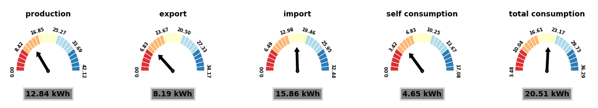
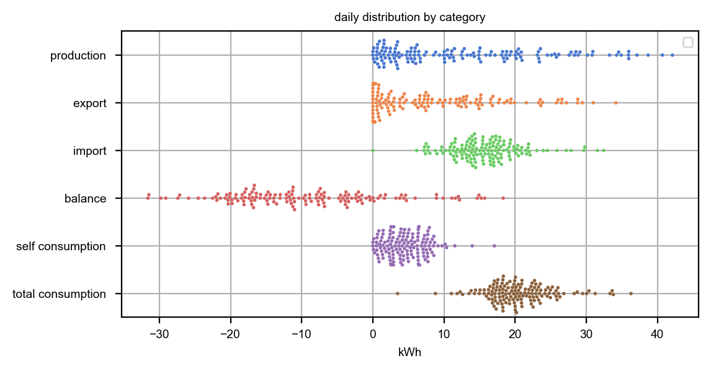
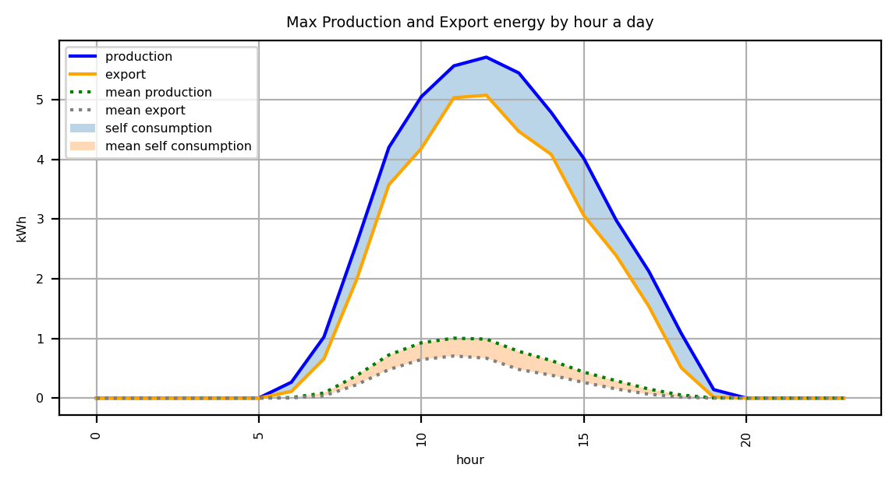
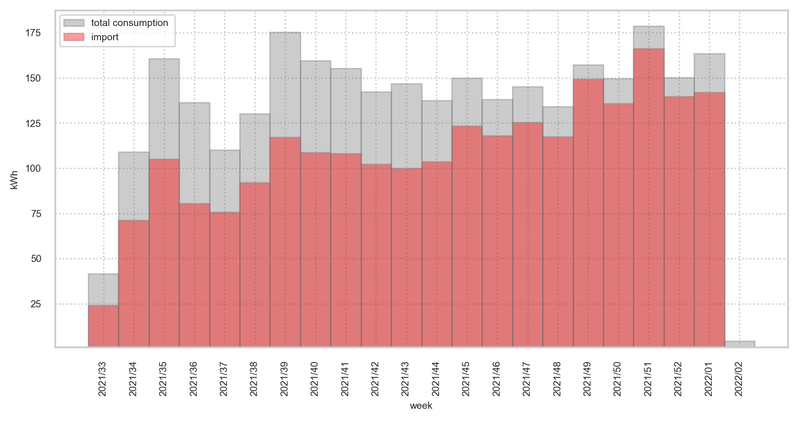

# Combine data from Tauron and Solar Installation
## prepared by: *Piotr Kalista*

based on solar inverter *SolarEdge*, *e-Tauron* **API** access
licence: *feel free to use*
---------------------------------------------------------
## Table of contnets
* [General Info](#general-info)
* [Content](#content)
* [Way of Working](#way-of-working)
* [Technologies](#technologies)
* [Contact Info](#contact-info)
* [Project Status](#project-status)
* [Some graph examples](#Examples)

## General info
* based on API collect PV energy production data from SolarEdge inverter 
* based on API collect energy import/export data from Tauron e-licznik 
* collect data in created obiect (classes: my_energy (abstract), my_SolarEdge, my_Tauron) 
* based on my_energy methods prepare pdf report 
* file energy_projection.ipynb based on excel weather historic data train a few models to finally select one to predict ***PV production*** and ***self consumption***. Exaple of prediction in graph bellow 


## Content
* project include package Energy responsible for collecting and transforming data, grouping and reporting
* modul Energy structure (folder structure)
```
Project
 │ └─ Energy
 │      └─ subEnergy
 │         my_energy.py (main energy class)
 │         my_solaredge.py (solaredge class based on energy)
 │          my_tauron.py (tauron class based on energy)
 │      └─ subGraphs
 │          my_plots.py (standard plots used by my_energy)
 │          my_graph_speedo.py (speedometer plot used by my_energy)
 │      └─ subProjection
 │         my_projection.py (standard plots used by my_energy)
 │      └─ subTools
 │          my_pdf.py (define main pdf class with header, footer, ...)
 │          projection_tools.py (some projection functions)
 │          Tuaron_API.py (API access function)
 │         tools.py (various)
 │      loginData.py (access kesy and passwords to SolarEdge and tauron)
 │      my_energy_reports.py (main function building energy object)
```
* additionaly there are some additional folders in main directory:
```
 └─ Imported 
 │      place for csv files with already imported data (tauron, SolarEdge)
 └─ output 
 │      place for created *.png and *.pdf files
 └─ other
        other data (weather_data.xlsx)
```
* main directory contains two files:
    * energy_reports.py (main program)
    * energy_projection.ipynb (projection models calc and pickle)
    * easy_example.ipynd (simply examples of usage)

## way of working
* main program ***energy_reports.py*** use start parameters to configure the way of working:
    * flag -d(--debug) define to switch on debugging messages
    * flag -r(--refresh) define to refresh or not data from API
    * flag -f(--flash) define to include or not flash report in final pdf
    * flag -t(--table) define to include or not pure table with data in final pdf
    * flag -b(--back) define level of lost energy when energy is exported to Tauron
    * flag -k(--kWh_cost) define cost 1 kWh
    * flag -p(--projection) define no of projected months
    * flag -g(--group) define way of grouping the data (daily, weekly, monthly)
    * flag -l(--limits) define time limits (example: 2021/09-2022/01)
    example of usage: energy_reports.py -drft -b 0.2 -k 0.65 -p 8 -g weekly -l 2021/45-2022/02
## Technologies
* python 3.8
* picle
* numpy, pandas, sklearn
* argparse
* matplotlib, seaborn
* fpdf
* requests, urllib3, ssl

## Contact info
* project designed and developed by Piotr Kalista
* email: pjkalista@gmail.com

## Project status
- [x] first stage finished 2022/01/15
- [ ] creating html instead of pdf 2022/02
- [ ] extra filtering based on dict (use pandas.DataFrame.query functionality)
- [ ] energy component configuration in json file, extend for another data supplier)
- [ ] web open access for users to colect and analyse data

## Examples
* speedometer

* swarmplot

* lineplot

* barplot

----


To proper use you have to create file **LoginData.py**

with login acces to **Tauron** and **SolarEdge**
Expected file structure:
> 
> \# solarEdge 
>
> APIKEY = 'xxxxxxxxxxxxxxxxxxxxxxxx'
>
> APIID = 'xxxxxxxxxxxxxxx'
>
> \# Tauron
>
> TAURON_USER_NAME = 'xxxxx@xxxxxxx.xxx'
>
> TAURON_PASS = 'xxxxxxxx'
>
> TAURON_METER_ID = xxxxxxxxxxxxxxxxxxx 


